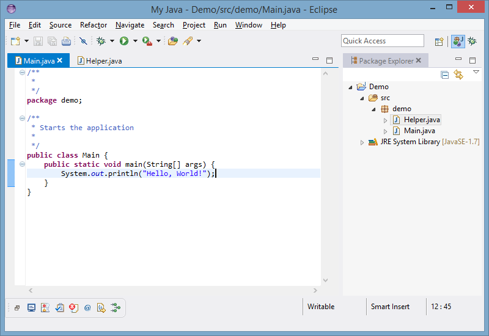

# Eclipse Preferences
## Color Theme
The color theme of Eclipse is configured using [Jeeeyul's Eclipse Themes](https://github.com/jeeeyul/eclipse-themes). The file [jeeeyul-visual-studio-light.epf](jeeeyul-visual-studio-light.epf) contains a custom preset, with the look of Visual Studio 2012.

#### Instructions

1. Make sure that `Jeeeyul's themes - Custom themes` is selected under `Window > Preferences > General > Appearance`.
2. Import the theme using  `Window > Preferences > General > Appearance > Jeeeyul's Themes > Presets > Import`.
3. Select the imported user preset.

## Workbench Perspectives
The *Java* and *Debug* perspectives are customized.

#### Instructions
Copy the file [workbench.xmi](workbench.xmi) into `.metadata/.plugins/org.eclipse.e4.workbench` of the workspace directory. 
